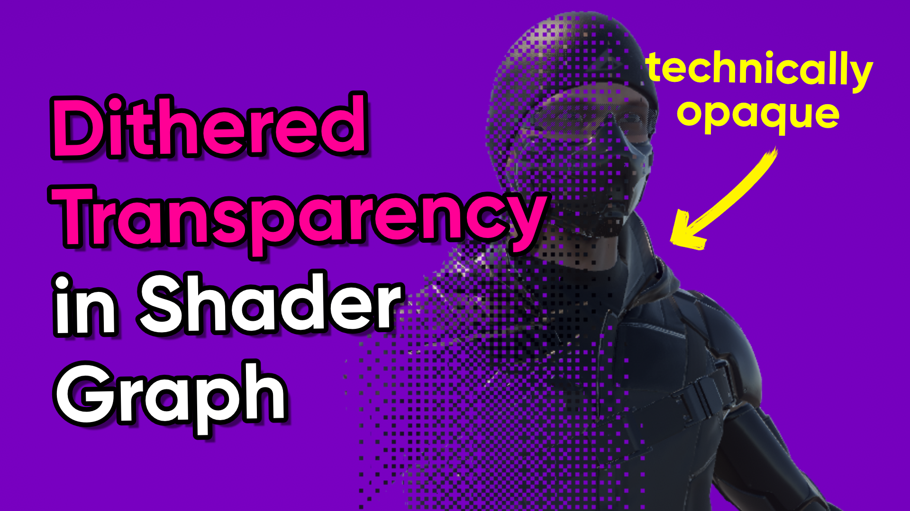

# Dither Transparency in Unity Shader Graph

A dithered transparency shader for Unity Shader Graph.

## Overview

Dither transparency is an effect which renders all pixels of your object using opaque rendering techniques (such as writing to the depth buffer so that other obscured objects can be culled), but using alpha clipping to cull pixels according to a Bayer matrix pattern such that the object still appears to be transparent when viewed at a sufficiently high resolution. Compared to alpha-blended transparency, you may see a performance boost associated with the lack of blending (although on mobile GPUs it can be *more* expensive, so please ensure you use the Profiler), and you also avoid some circumstances where alpha-blended transparency would be guaranteed to render incorrectly due to sorting issues.

## Software

This project was created using Unity 2022.3.0f1 (Long-Term Support).

## Tutorials

This project is part of a tutorial which is available here:

- [YouTube](https://www.youtube.com/watch?v=NHd1PeJfyzE)

## Authors

This project and the corresponding tutorials were created by Daniel Ilett.

## Release

This project was released on April 2nd 2024.
